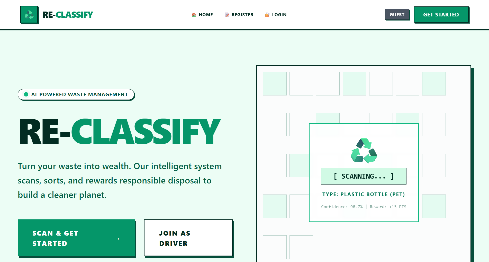
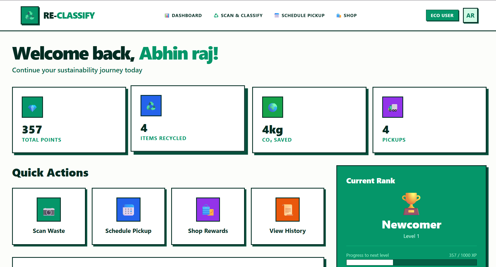
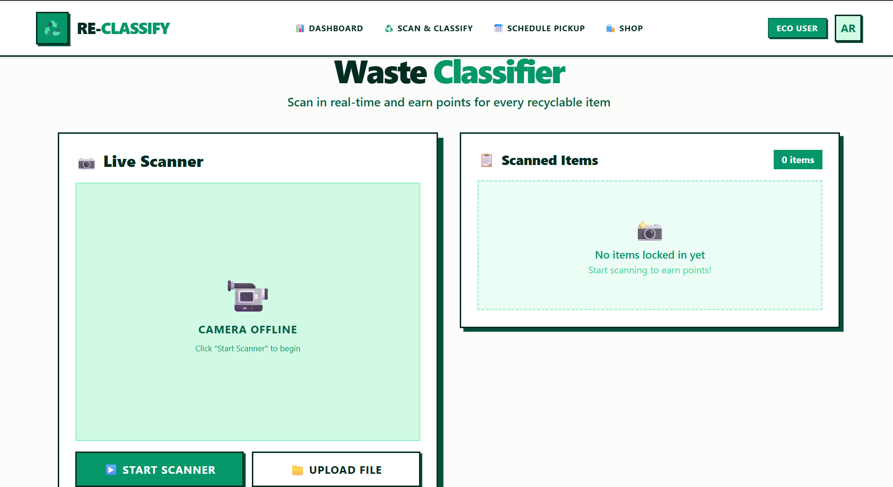
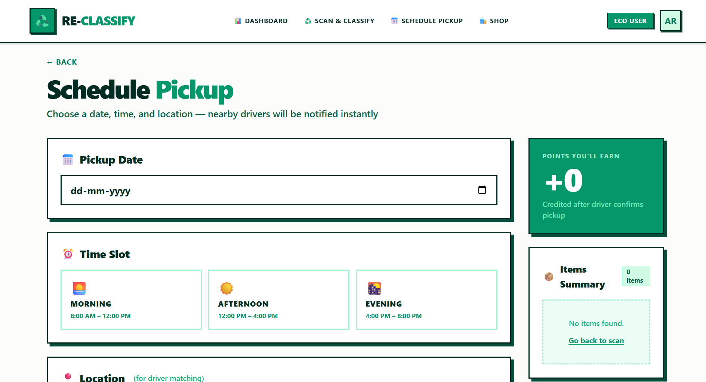
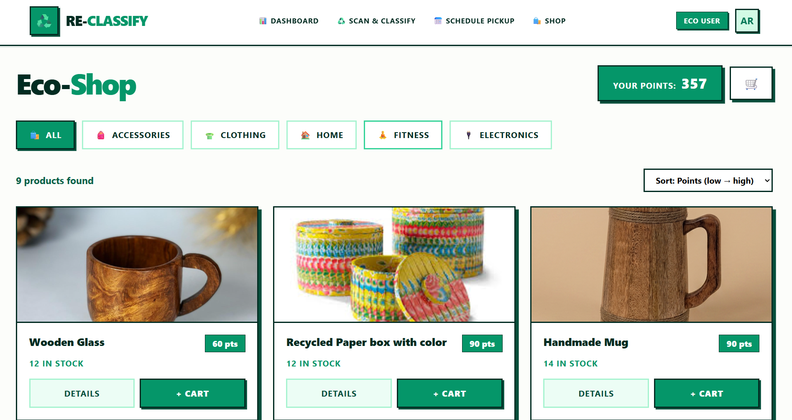
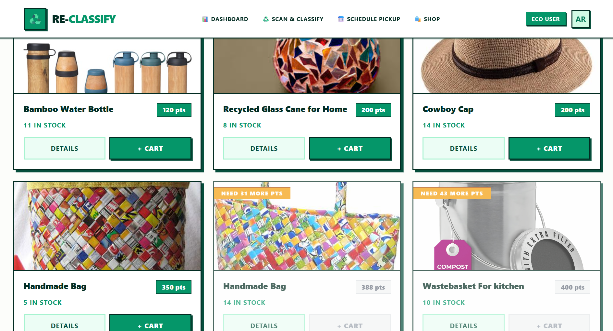
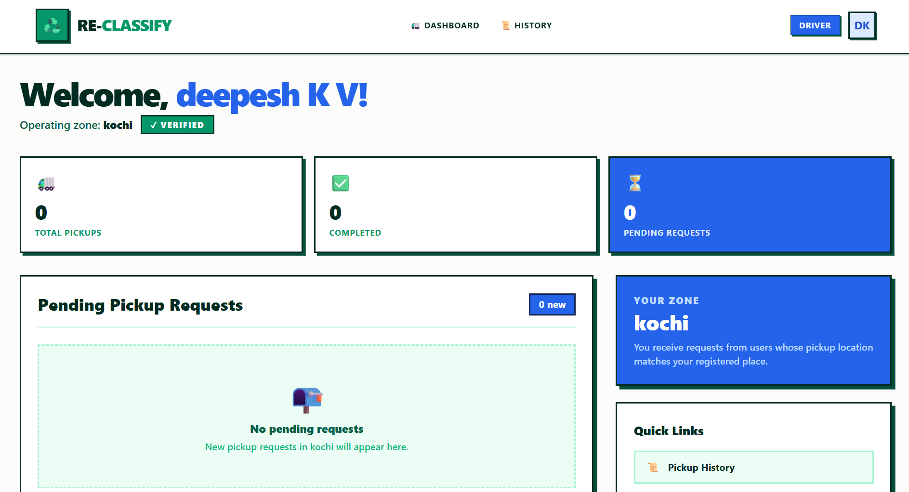
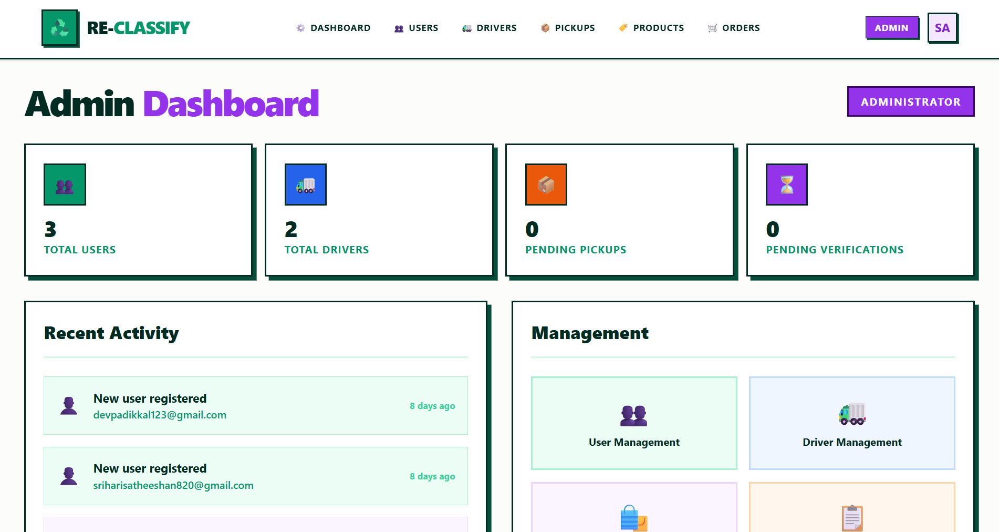

<div align="center">
  <br />
  <p>
<p align="center">
  
</p>
  </p>

  <h3>Turn Your Waste Into Wealth</h3>

  <p>
    <strong>AI-Powered Waste Management · Smart Scheduling · Rewards Marketplace</strong>
  </p>

  <br />

  <p>
    
    
    
    
    
    
    
  </p>

  <p>
    <a href="#features">✨ Features</a> •
    <a href="#tech-stack">🧱 Tech Stack</a> •
    <a href="#getting-started">🚀 Quick Start</a> •
    <a href="#api-endpoints">🔌 API</a> •
    <a href="#screenshots">📸 Screenshots</a> •
  </p>

  <br />
</div>

## 👋 Overview

**ReClassify** is a full-stack waste management ecosystem that combines **deep learning image classification**, **on-demand pickup logistics**, and a **gamified rewards marketplace** to make recycling rewarding.

| Role           | What They Do                                                      |
| -------------- | ----------------------------------------------------------------- |
| 👤 **Users**   | Scan waste with AI, schedule pickups, earn points, redeem rewards |
| 🚛 **Drivers** | Accept collection jobs, verify waste, earn income                 |
| 🛠️ **Admins**  | Manage users, drivers, products, orders, and platform oversight   |

```
🧑 User scans waste  →  🤖 AI classifies it  →  📦 Driver collects it
                                                     ↓
                     🛍️ User redeems points  ←  ⭐ Points credited
```

---

<a id="features"></a>

## ✨ Features

### 👤 User Module

| Feature                 | Description                                                                                                                                              |
| ----------------------- | -------------------------------------------------------------------------------------------------------------------------------------------------------- |
| 🧠 **AI Waste Scanner** | Point your camera at any waste item. AI identifies material type (Plastic, Paper, Metal, Glass, Cardboard, Trash) with confidence scores & disposal tips |
| 📅 **Smart Scheduling** | Book pickups at your convenience with preferred time slots. Real-time notifications when your driver is approaching                                      |
| ⭐ **Gamified Rewards** | Earn points for every item scanned & collected. Unlock badges, climb leaderboards, track your CO₂ savings                                                |
| 🛍️ **Eco-Shop**         | Redeem points for premium sustainable products — recycled backpacks, organic clothing, home composters & more                                            |
| 📊 **Impact Dashboard** | Live stats: items recycled, CO₂ saved, point balance, badges earned, recent scans                                                                        |

### 🚛 Driver Module

| Feature                   | Description                                                                                    |
| ------------------------- | ---------------------------------------------------------------------------------------------- |
| 🗺️ **Smart Routing**      | AI-optimized collection routes that minimize travel time & fuel costs. Turn-by-turn navigation |
| ✅ **Waste Verification** | Photo capture & digital signatures to confirm waste authenticity at pickup                     |
| 🔔 **Live Updates**       | Real-time pickup requests, schedule changes, and in-app communication with users               |
| 💰 **Earnings Dashboard** | Track daily earnings, completion rates, performance metrics, and weekly payouts                |

### 🛠️ Admin Module

| Feature                   | Description                                                 |
| ------------------------- | ----------------------------------------------------------- |
| 👥 **User Management**    | View, search, activate/deactivate all platform users        |
| 🚚 **Driver Management**  | Onboard, verify, and manage driver partners                 |
| 📦 **Product Management** | Add/edit reward products with image uploads & point pricing |
| 📋 **Order Oversight**    | Monitor and fulfill reward redemptions                      |
| 👁️ **Pickup Oversight**   | Real-time tracking of all pickups across the platform       |

### 🤖 AI Classification

| Detail          | Info                                               |
| --------------- | -------------------------------------------------- |
| **Model**       | Deep learning CNN (PyTorch)                        |
| **Categories**  | Plastic, Paper, Metal, Glass, Cardboard, Trash     |
| **Accuracy**    | >98% confidence                                    |
| **Backend**     | Python FastAPI microservice (port 8000)            |
| **Integration** | Express proxies classification requests to FastAPI |

---

<a id="tech-stack"></a>

## 🧱 Tech Stack

```
┌──────────────────────────────────────────────────────────────┐
│                     FRONTEND (React 19)                       │
│  Vite · Tailwind CSS · React Router DOM v7 · ESLint          │
└──────────────────────┬───────────────────────────────────────┘
                       │ HTTP / JSON
┌──────────────────────┴───────────────────────────────────────┐
│                    BACKEND (Express.js 5)                      │
│  Auth · Users · Drivers · Bookings · Shop · Orders · Admin   │
│  JWT · bcrypt · Multer · CORS · dotenv                       │
└──────────────────────┬───────────────────────────────────────┘
                       │ Mongoose
┌──────────────────────┴───────────────────────────────────────┐
│                  DATABASE (MongoDB Atlas)                      │
│  7 Collections: User · Driver · Booking · Product · Order    │
│                 Reward · Notification                         │
└──────────────────────────────────────────────────────────────┘
                       │ HTTP
┌──────────────────────┴───────────────────────────────────────┐
│               AI MICROSERVICE (Python FastAPI)                 │
│              PyTorch · Waste Classification Model              │
└──────────────────────────────────────────────────────────────┘
```

| Layer                                                                                                      | Technology                                   |
| :--------------------------------------------------------------------------------------------------------- | :------------------------------------------- |
|               | **React 19** — Component-based UI with hooks |
|                 | **Vite 8** — Ultra-fast HMR dev server       |
|  | **Tailwind CSS 3.4** — Utility-first styling |
|           | **Express.js 5** — RESTful API server        |
|           | **MongoDB Atlas** — Cloud NoSQL database     |
|         | **Mongoose 9** — Elegant ODM for MongoDB     |
|         | **JWT + bcrypt** — Secure authentication     |
|           | **PyTorch** — Deep learning classification   |
|           | **FastAPI** — Python AI microservice         |
|            | **Multer** — File/image upload handling      |

---

<a id="getting-started"></a>

## 🚀 Getting Started

### Prerequisites

| Tool    | Version                         |
| :------ | :------------------------------ |
| Node.js | >= 18                           |
| npm     | >= 9                            |
| Python  | >= 3.9 (for AI backend)         |
| MongoDB | Atlas account (free tier works) |

### 1️⃣ Clone

```bash
git clone https://github.com/harysri/Reclassify.git
cd Reclassify
```

### 2️⃣ Environment Variables

Create `server/.env`:

```env
PORT=5000
MONGO_URI=mongodb+srv://<user>:<password>@cluster.xxxxx.mongodb.net/reclassify?retryWrites=true&w=majority
JWT_SECRET=your_super_secret_jwt_key_here
FASTAPI_BASE_URL=http://localhost:8000
ADMIN_EMAIL=admin@reclassify.com
ADMIN_PASSWORD=Create your admin password here
```

### 3️⃣ Backend

```bash
cd server
npm install
npm start
# → Server running on http://localhost:5000
# → MongoDB Atlas connected
# → Admin account seeded
```

### 4️⃣ Frontend

```bash
cd client
npm install
npm run dev
# → http://localhost:5173
```

### 5️⃣ AI Backend (optional)

```bash
cd torch_backend_py

# Windows
python -m venv venv
venv\Scripts\activate

# macOS / Linux
# python3 -m venv venv
# source venv/bin/activate

pip install -r requirements.txt
python main.py
# → FastAPI running on http://localhost:8000
# → Swagger docs at http://localhost:8000/docs
```

---

## 📁 Project Structure

```
reclassify/
│
├── client/                          # 🎨 React Frontend
│   ├── public/
│   └── src/
│       ├── Components/
│       │   ├── Navbar.jsx           # Navigation bar
│       │   ├── Footer.jsx           # Site footer
│       │   └── Authcontext.jsx      # JWT auth context provider
│       ├── Pages/
│       │   ├── Admin/
│       │   │   ├── AdminDashboard.jsx
│       │   │   ├── DriverManagement.jsx
│       │   │   ├── Driverdetail.jsx
│       │   │   ├── ProductManagement.jsx
│       │   │   ├── UserManagement.jsx
│       │   │   ├── PickupOversight.jsx
│       │   │   └── OrdersOverview.jsx
│       │   ├── Driver/
│       │   │   ├── DriverDashboard.jsx
│       │   │   ├── ActivePickup.jsx
│       │   │   ├── BookingDetail.jsx
│       │   │   ├── DriverProfile.jsx
│       │   │   └── DriverPickupHistory.jsx
│       │   ├── User/
│       │   │   ├── UserDashboard.jsx
│       │   │   ├── WasteClassification.jsx
│       │   │   ├── SchedulePickup.jsx
│       │   │   ├── Shop.jsx
│       │   │   ├── Cart.jsx
│       │   │   ├── Checkout.jsx
│       │   │   ├── Profile.jsx
│       │   │   ├── RewardTracker.jsx
│       │   │   ├── Pickuphistory.jsx
│       │   │   ├── Orderhistory.jsx
│       │   │   └── ProductDetail.jsx
│       │   ├── Home.jsx             # Landing page
│       │   ├── Login.jsx
│       │   └── Signup.jsx
│       ├── App.jsx
│       └── main.jsx
│
├── server/                          # 🖥️ Express API
│   ├── config/
│   │   └── seedAdmin.js             # Seeds default admin on startup
│   ├── middleware/
│   │   └── auth.js                  # JWT verification middleware
│   ├── models/
│   │   ├── User.js                  # name, email, passwordHash, role, rewardPoints
│   │   ├── Driver.js                # Driver profile & zone
│   │   ├── Booking.js               # userId, driverId, items, address, status, pointsAwarded
│   │   ├── Product.js               # name, points, stock, category, imageUrl
│   │   ├── Order.js                 # Reward redemption orders
│   │   ├── Reward.js                # Reward/points ledger
│   │   └── Notification.js          # Push/in-app notifications
│   ├── routes/
│   │   ├── auth.js                  # /api/auth
│   │   ├── user.js                  # /api/user
│   │   ├── driver.js                # /api/driver
│   │   ├── admin.js                 # /api/admin
│   │   ├── bookings.js             # /api/bookings
│   │   ├── shop.js                  # /api/shop
│   │   ├── orders.js                # /api/orders
│   │   ├── rewards.js               # /api/rewards
│   │   └── waste_classify.js        # /api/waste (proxy → FastAPI)
│   ├── uploads/                     # Product images (served statically)
│   ├── index.js                     # Express app entry point
│   └── package.json
│
├── torch_backend_py/                # 🤖 AI Microservice
│   ├── main.py                      # FastAPI classification endpoint
│   ├── requirements.txt             # torch, torchvision, fastapi, uvicorn, pillow
│   └── weights/                     # Trained model weights
│
├── screenshots/                     # 📸 App screenshots
├── README.md
└── .gitignore
```

---

<a id="api-endpoints"></a>

## 🔌 API Endpoints

> All endpoints (except auth) require `Authorization: Bearer <jwt_token>` header.

### 🔐 Authentication

| Method | Endpoint             | Description                    | Auth |
| :----- | :------------------- | :----------------------------- | :--- |
| `POST` | `/api/auth/register` | Create user account            | ❌   |
| `POST` | `/api/auth/login`    | Login → returns JWT token      | ❌   |
| `GET`  | `/api/auth/profile`  | Get authenticated user profile | ✅   |

### 👤 User

| Method | Endpoint              | Description                     | Auth |
| :----- | :-------------------- | :------------------------------ | :--- |
| `GET`  | `/api/user/dashboard` | User dashboard stats & metrics  | ✅   |
| `PUT`  | `/api/user/profile`   | Update profile details          | ✅   |
| `GET`  | `/api/user/rewards`   | Reward points balance & history | ✅   |

### 🚛 Driver

| Method | Endpoint                          | Description                                        | Auth |
| :----- | :-------------------------------- | :------------------------------------------------- | :--- |
| `GET`  | `/api/driver/dashboard`           | Driver earnings & job stats                        | ✅   |
| `GET`  | `/api/driver/bookings`            | Assigned pickup requests                           | ✅   |
| `PUT`  | `/api/driver/bookings/:id/status` | Update job status (accepted/in_progress/completed) | ✅   |

### 📦 Bookings

| Method | Endpoint             | Description                 | Auth |
| :----- | :------------------- | :-------------------------- | :--- |
| `POST` | `/api/bookings`      | Create new pickup booking   | ✅   |
| `GET`  | `/api/bookings/user` | Get current user's bookings | ✅   |
| `GET`  | `/api/bookings/:id`  | Get single booking details  | ✅   |

### 🛍️ Shop & Orders

| Method | Endpoint                 | Description                  | Auth |
| :----- | :----------------------- | :--------------------------- | :--- |
| `GET`  | `/api/shop/products`     | List all reward products     | ❌   |
| `GET`  | `/api/shop/products/:id` | Get product details          | ❌   |
| `POST` | `/api/orders`            | Redeem points → create order | ✅   |
| `GET`  | `/api/orders/user`       | Get user's order history     | ✅   |

### 🛠️ Admin

| Method | Endpoint                     | Description            | Auth     |
| :----- | :--------------------------- | :--------------------- | :------- |
| `GET`  | `/api/admin/users`           | List all users         | ✅ Admin |
| `GET`  | `/api/admin/drivers`         | List all drivers       | ✅ Admin |
| `POST` | `/api/admin/products`        | Create reward product  | ✅ Admin |
| `PUT`  | `/api/admin/products/:id`    | Update product details | ✅ Admin |
| `POST` | `/api/admin/products/upload` | Upload product image   | ✅ Admin |
| `GET`  | `/api/admin/bookings`        | All bookings oversight | ✅ Admin |
| `GET`  | `/api/admin/orders`          | All orders oversight   | ✅ Admin |

### 🤖 AI Waste Classification

| Method | Endpoint              | Description                                       | Auth |
| :----- | :-------------------- | :------------------------------------------------ | :--- |
| `POST` | `/api/waste/classify` | Upload image → AI returns waste type & confidence | ✅   |

### ❤️ Health

| Method | Endpoint      | Description          |
| :----- | :------------ | :------------------- |
| `GET`  | `/api/health` | `{ "status": "ok" }` |

---

<a id="screenshots"></a>

## Screenshots

<div align="center">
  <h3 align="left">Home Page</h3>
  

  

  

  


  <div style="display:flex; flex-wrap:wrap; justify-content:center; gap:16px; margin-top:16px;">
    <div>
      <h4 align="left">User Dashboard</h4>
      
    </div>
    <div>
      <h4 align="left">AI Scanner</h4>
      
    </div>
    <div>
      <h4 align="left">Schedule Pickup</h4>
      
    </div>
    <div>
      <h4 align="left">Rewards Shop</h4>
      <span style="display:block; text-align:center; margin:8px 0;"></span>
      
    </div>
    <div>
      <h4 align="left">Driver Dashboard</h4>
      
    </div>
    <div>
      <h4 align="left">Admin Dashboard</h4>
      
    </div>
  </div>
</div>

---

## 💡 Usage Guide

### As a 👤 User

```
Sign Up → Scan Waste → Schedule Pickup → Driver Collects → Earn Points → Shop Rewards
```

1. **Sign Up** — Create an account with your email, phone, and address.
2. **Scan Waste** — Use the AI scanner to identify items. Each scan earns points.
3. **Schedule Pickup** — Select date/time slot. A verified driver is matched to your zone.
4. **Earn Points** — Points are credited after successful pickup completion.
5. **Shop Rewards** — Browse the Eco-Shop and redeem points for sustainable products.
6. **Track Impact** — Monitor your CO₂ savings, recycling stats, and badges on the dashboard.

### As a 🚛 Driver

```
Register → Set Zone → Accept Jobs → Verify Collection → Get Paid
```

1. **Register** — Create a driver profile with your service zone/area.
2. **Accept Jobs** — View incoming pickup requests in your dashboard.
3. **Verify Collection** — Use photo capture at pickup to confirm waste collection.
4. **Complete** — Mark job as completed. Points are auto-awarded to the user.
5. **Get Paid** — Track earnings and receive weekly payouts.

### As a 🛠️ Admin

```
Login → Manage Platform → Oversee Operations
```

1. **Login** — Use admin credentials (seeded automatically on first server start).
2. **Manage Users** — Activate/deactivate accounts, search, view details.
3. **Manage Drivers** — Verify driver applications, monitor performance.
4. **Manage Products** — Add/edit reward items with images and point pricing.
5. **Oversee** — Monitor all pickups, orders, and platform metrics in real time.

---

## 🔮 Roadmap

- [ ] **Real-time GPS tracking** for active pickups
- [ ] **Multi-language support** (i18n)
- [ ] **React Native mobile app**
- [ ] **WhatsApp / SMS push notifications**
- [ ] **Advanced admin analytics** (charts, export)
- [ ] **Driver rating & review system**
- [ ] **Recurring pickup subscriptions**
- [ ] **Community recycling leaderboards**
- [ ] **Carbon offset certificate downloads**
- [ ] **Payment gateway** (Stripe/Razorpay) for premium services
- [ ] **Waste-to-art marketplace** (upcycled creations)

---

## 🤝 Contributing

Contributions are welcome and appreciated!

```bash
# 1. Fork the repo
# 2. Create your feature branch
git checkout -b feature/amazing-feature

# 3. Commit your changes
git commit -m "Add amazing feature"

# 4. Push to the branch
git push origin feature/amazing-feature

# 5. Open a Pull Request
```

## 👤 Author

**Srihari Satheeshan**

|                                                                                                 |                                        |
| :---------------------------------------------------------------------------------------------- | :------------------------------------- |
|  | [@harysri](https://github.com/harysri) |
|    | sriharisatheeshan820@gmail.com         |

---

## 🙏 Acknowledgements

- [PyTorch](https://pytorch.org/) — Deep learning framework powering waste classification
- [Tailwind CSS](https://tailwindcss.com/) — Utility-first CSS that makes styling effortless
- [Vite](https://vitejs.dev/) — Blazing-fast build tool and dev server
- [MongoDB Atlas](https://www.mongodb.com/atlas) — Reliable cloud database platform
- [React Router](https://reactrouter.com/) — Declarative routing for React
- [Heroicons](https://heroicons.com/) — Beautiful SVG icons used throughout the UI

---

<p align="center">
  
</p>
</div>
